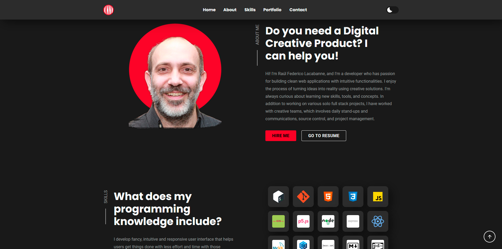

# Raúl Federico Lacabanne | Personal Portfolio



Welcome to the official repository for the personal portfolio of **Raúl Federico Lacabanne (KNNV)**. This single-page, fully responsive website is designed to highlight professional skills, metrics, and key software projects, featuring custom-built interactive elements and design system configurations.

---

## 🚀 Key Features

*   **Responsive Layout**: Optimized for Desktop (≥ 992px), Tablet (≥ 500px), and Mobile devices using media queries and CSS grid/flexbox.
*   **Persistent Theme Switching**: Interactive dark/light mode toggle with state saved in `localStorage`.
*   **Dynamic Tabs**: Client-side switcher to toggle between **Skills** (languages, frameworks, environments) and **Tools** (platforms, editors, software).
*   **Contact Form Integration**: Fully functional contact form leveraging the **FormSubmit** API endpoint.
*   **User Experience Polish**:
    *   Sticky header navigation backdrop on scroll.
    *   Scroll-to-top quick action button.
    *   Smooth scroll behaviors between section anchors.

---

## 🛠️ Technology Stack

1.  **HTML5**: Semantic tags and structuring.
2.  **CSS3 (Vanilla)**: Features responsive layouts, design tokens, transition effects, and dual dark/light themes.
3.  **JavaScript (ES6+)**: Custom DOM-manipulation logic, state tracking, and local storage access.
4.  **Ionicons**: Modern icons pack integration.
5.  **FormSubmit**: Handled serverless contact requests.

---

## 🎨 Color Palette & Themes

The design is built on a custom color scheme configured inside [style-guide.md](file:///D:/code/portfolio/style-guide.md) and [assets/css/style.css](file:///D:/code/portfolio/assets/css/style.css):

### Accent Colors
*   **Primary Dark Red**: `#d90429` (`--raw-seinna`)
*   **Deep Orange/Red**: `hsl(13, 96%, 47%)` (`--scarlet`)
*   **Sizzling Sunrise**: `hsl(51, 95%, 54%)` (`--sizzling-sunrise`)

### Theme Modes

| Variable | Dark Mode (Default) | Light Mode |
| :--- | :--- | :--- |
| `--bg-primary` | `hsl(0, 0%, 12%)` | `hsl(0, 0%, 90%)` |
| `--bg-secondary` | `hsl(0, 0%, 19%)` | `hsl(0, 0%, 100%)` |
| `--color-primary` | `hsl(0, 0%, 100%)` | `hsl(0, 0%, 12%)` |
| `--color-secondary`| `hsl(0, 0%, 62%)` | `hsl(0, 0%, 37%)` |

---

## 📂 Project Structure

*   [index.html](file:///D:/code/portfolio/index.html) — Single-page HTML entry point.
*   [style-guide.md](file:///D:/code/portfolio/style-guide.md) — Specifications for the typography scale and colors.
*   [GEMINI.md](file:///D:/code/portfolio/GEMINI.md) — Comprehensive technical documentation and developer guides.
*   `assets/` — Static assets and source files:
    *   [assets/css/style.css](file:///D:/code/portfolio/assets/css/style.css) — Custom stylesheet containing baseline styling, layout blocks, and media queries.
    *   [assets/js/script.js](file:///D:/code/portfolio/assets/js/script.js) — Optimized interactive behaviors (header, navbar, tabs, theme persistent state).
    *   `assets/images/` — Image assets (logos, background images, and project thumbnails).

---

## 💻 Running the Project Locally

Since this is a static site, you don't need compilation or installation:

1. Clone the repository:
   ```bash
   git clone https://github.com/knnv-ar/portfolio.git
   ```
2. Open [index.html](file:///D:/code/portfolio/index.html) directly in any modern web browser, or serve it using a local dev server like VS Code Live Server or Python's HTTP server:
   ```bash
   # Using Python
   python -m http.server 8000
   ```

---

## 🏷️ Credits & Acknowledgements

*   **Base Design & Reference**: Based on the project "Creative Personal Portfolio Using HTML CSS Javascript" from the YouTube channel [OnlineTutorialsYT](https://www.youtube.com/@OnlineTutorialsYT) by [codewithsadee](https://github.com/codewithsadee).
*   **Media Assets**: Vector artwork and assets provided by **Harryarts** and **lukasdedi** on [Freepik](https://www.freepik.com).
